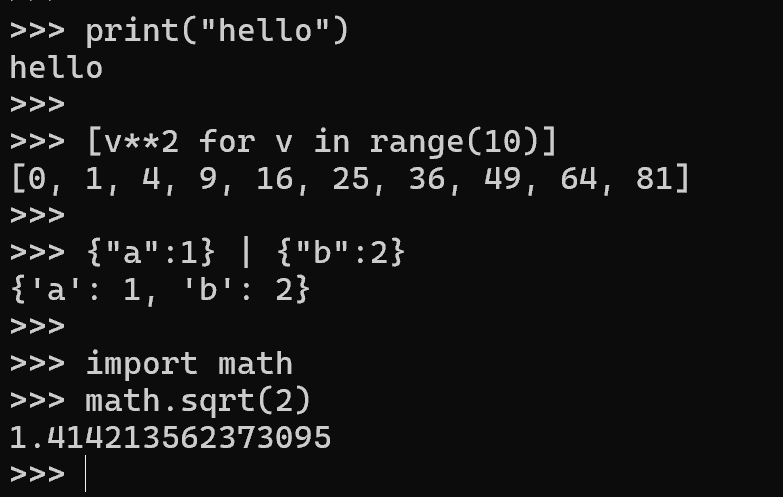
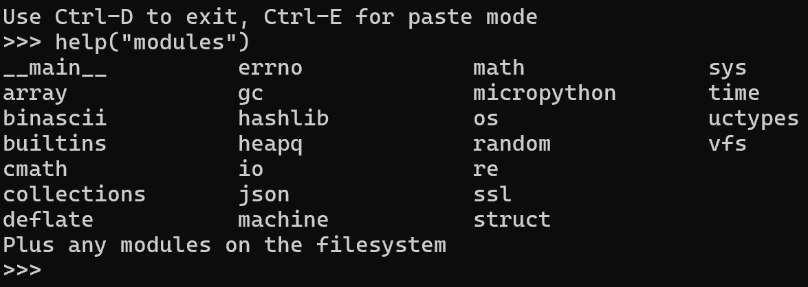
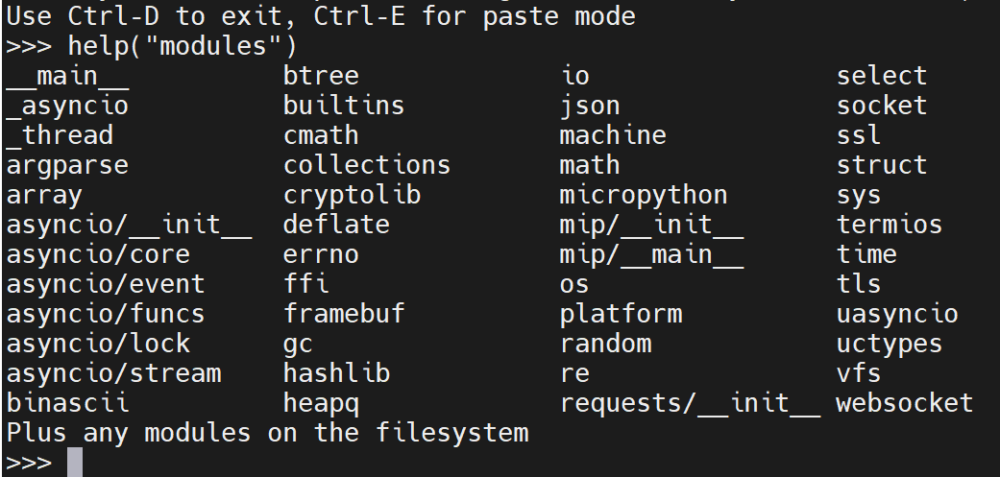

# micropython-ports-prebuilt
Very tiny python executable built based on [offical micropython repository](https://github.com/micropython/micropython)

### windows port
Executable size: ~537KB
Smaller version: without icon ~370KB (or even ~164KB after upx!)

### unix port
Executable size: ~800KB
